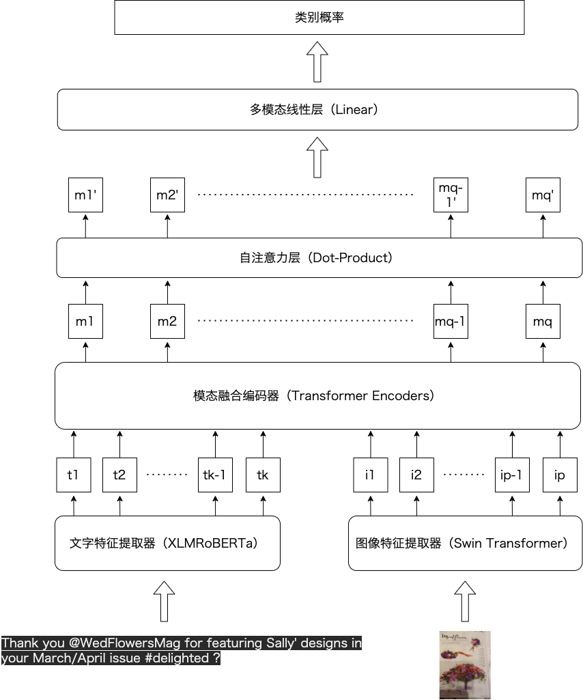

# PTAMSC: Pure Transformer-flavored Augmented Multi-modal Sentiment Classifier

Author: GONGGONGJOHN

This is the official repository for the final project of DaSE undergraduate course "Contemporary Artificial Intelligence": Multimodal Sentiment Analysis. All the scripts and results are supposed to be executable and repoducible.

## Setup

本项目使用Python3.8开发完成，相关依赖模块已导出至`requirements.txt`。使用如下命令即可直接安装所有依赖包：

```shell
pip -r requirements.txt
```

代码运行的主要依赖包及版本如下：

- chardet 4.0.0
- matplotlib 3.3.2
- Pillow 9.2.0
- scikit_learn 1.1.1
- torch 1.9.0
- torchvision 0.10.0
- tqdm 4.64.0
- transformers 4.20.1

## Repository Structure

```
.
├── README.md
├── assets
│   └── ptamsc_structure.png
├── baseline_model.py
├── bert_baseline.py
├── bert_train.py
├── data_pipe.py
├── data_utils.py
├── main.py
├── model.py
├── plot
│   ├── fuse_accuracy.png
│   ├── hypertune_lr1.png
│   ├── hypertune_lr2.png
│   ├── hypertune_warmup.png
│   ├── plot_clmlf_pretrain.py
│   ├── plot_clmlf_train.py
│   ├── plot_fuse_accuracy.py
│   ├── plot_hypertune.py
│   ├── plot_resnet_f1.py
│   ├── ptamsc_acc.png
│   ├── ptamsc_f1.png
│   ├── ptamsc_loss.png
│   ├── ptamsc_pretrain_acc.png
│   ├── ptamsc_pretrain_f1.png
│   ├── ptamsc_pretrain_loss.png
│   └── resnet_f1.png
├── resnet_train.py
├── swin_baseline.py
├── swin_train.py
├── xlm_baseline.py
├── xlm_hypertune.py
└── xlm_train.py
```

## Model Overview

PTAMSC的主要模型结构如下图所示：



## Performance

| Model            | Accuracy | Precision | Recall | F1   |
| ---------------- | -------- | --------- | ------ | ---- |
| Bert             | 72.99    |           |        |      |
| XLMRoBERTa       | 73.58    |           |        |      |
| ResNet           |          |           |        |      |
| Swin Transformer |          |           |        |      |
| X+S(Concatenate) |          |           |        |      |
| X+S(Additive)    |          |           |        |      |
| PTAMSC           |          |           |        |      |


## Reproduce Experiment

若要使用原数据集运行实验，请将图像/文本数据放在`data/source/`中。由于原数据集中包含非utf-8/ANSI编码文本，请先使用GBK编码打开并将其翻译为英语再进行读取。

### Baseline Model

```shell
python baseline.py --data_path [数据集根目录]
```

### Main Model

```shell
python main.py --do_train --do_eval --do_test --data_path [数据集根目录]
```

## References

We only list some major reference papers here, the full references list can be found in the project report:

1. Dzmitry Bahdanau, Kyunghyun Cho, and Yoshua Bengio. Neural machine translation by jointly learning to align and translate. CoRR, abs/1409.0473, 2015.
2. Alexis Conneau, Kartikay Khandelwal, Naman Goyal, Vishrav Chaudhary, Guillaume Wenzek, Francisco Guzmán, Edouard Grave, Myle Ott, Luke Zettlemoyer, and Veselin Stoyanov. Unsupervised cross-lingual representation learning at scale. In Proceedings of the 58th Annual Meeting of the Association for Computational Linguistics, pages 8440–8451, Online, July 2020. Association for Computational Linguistics.
3. Ze Liu, Yutong Lin, Yue Cao, Han Hu, Yixuan Wei, Zheng Zhang, Stephen Lin, and Baining Guo. Swin transformer: Hierarchical vision transformer using shifted windows. In Proceedings of the IEEE/CVF International Conference on Computer Vision (ICCV), 2021.
4. Zhen Li, Bing Xu, Conghui Zhu, and Tiejun Zhao. CLMLF:a contrastive learning and multi-layer fusion method for multimodal sentiment detection. In Findings of the Association for Computational Linguistics: NAACL 2022. Association for Computational Linguistics, 2022.
5. Yan Ling, Jianfei Yu, and Rui Xia. Vision-language pre-training for multimodal aspect-based sentiment analysis. In Proceedings of the 60th Annual Meeting of the Association for Computational Linguistics (Volume 1: Long Papers), pages 2149– 2159, Dublin, Ireland, May 2022. Association for Computational Linguistics.
6. Aäron van den Oord, Yazhe Li, and Oriol Vinyals. Representation learning with contrastive predictive coding. CoRR, abs/1807.03748, 2018.
7. Ashish Vaswani, Noam Shazeer, Niki Parmar, Jakob Uszkoreit, Llion Jones, Aidan N Gomez, Ł ukasz Kaiser, and Illia Polosukhin. Attention is all you need. In I. Guyon, U. Von Luxburg, S. Bengio, H. Wallach, R. Fergus, S. Vishwanathan, and R. Garnett, editors, Advances in Neural Information Processing Systems, volume 30. Curran Associates, Inc., 2017.

